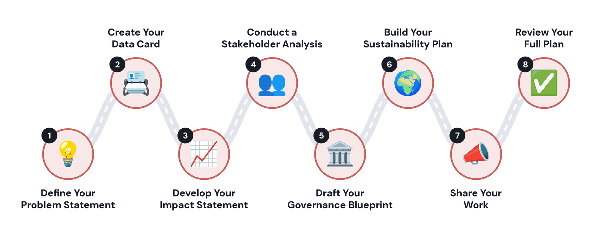

# AIRF Capstone Project Recipes

**Recipes for Implementing and Evaluating Your Capstone Projects**

Short, end-to-end recipes for AI capstone projects, for university lecturers and learners across Africa. Each recipe runs in one Google Colab notebook on a free T4 GPU, uses small open-weight language models (Gemma 3 1B and 4B), and follows the same steps:

**Implement → Evaluate → Inspect → Reflect → Extend**

## 🗺️ Capstone Roadmap

Every capstone follows the same roadmap, from the problem you want to solve to a full plan you can share:

<p align="center">
  
</p>

## 📚 Recipe Catalogue

| # | Recipe | What you'll investigate | Core technique |
|---|---|---|---|
| 1 | [Build a Customer Support Intent Classifier](projects/customer-support-assistant/) | Does fine-tuning improve a small language model's ability to classify support requests? | Prompting + QLoRA |
| 2 | [Build a Customer Support Response Generator](projects/customer-support-response-generation/) | Does fine-tuning improve the quality of generated support responses? | Supervised fine-tuning |
| 3 | [Build a News Headline Generator](projects/news-headline-generation/) | Does fine-tuning improve a small language model's ability to generate concise and informative news headlines? | Zero-shot prompting + QLoRA |
| 4 | [Build a Multilingual Health QA System](projects/multilingual-health-qa/) | How well does a small language model answer health questions across African languages? | Multilingual generation + few-shot prompting |
| 5 | [Build a Synthetic Dataset for an African Language](projects/african-language-synthetic-data/) | Can synthetic data improve downstream language model performance? | Synthetic data generation |
| 6 | [Build a Domain-Specific Agricultural Small Language Model](projects/domain-specific-agriculture/) | Does domain adaptation improve a small language model's performance in agriculture? | Domain adaptation / fine-tuning |
| 7 | [Classify Healthcare SMS by Urgency](projects/healthcare-sms-urgency/) | How reliably can a language model identify different levels of urgency? | Prompting + fine-tuning |
| 8 | [Build Your Own Personalised AI Tutor](projects/personalised-ai-tutor/) | Can a reward model learn a learner's preferences and make the same tutor teach the way that learner wants? | Preference alignment: reward model + reward-guided fine-tuning |

Each recipe folder contains:

- `README.md`: the recipe in two minutes.
- `DATASET_CARD.md`: the dataset, its source, licence and how it was adapted.
- `notebook.ipynb`: the experiment, ready to open in Colab.

The [`completed/`](completed/) folder has a completed run of every notebook, with all its outputs, so you can see the results before running a recipe yourself.

## 🚀 How to Use a Recipe

1. **Choose a recipe:** Go to the recipe that matches your interests or research area.

2. **Read the documentation:** Read the `README.md` and `DATASET_CARD.md` to understand the problem, research question, dataset, evaluation approach, model, and relevant considerations.

3. **Open in Colab:** Open `notebook.ipynb` in Google Colab and save your own copy to Google Drive.

4. **Run the notebook:** Run the notebook from start to finish to reproduce the experiment and results, and compare them with the [completed run](completed/).

5. **Use the Gemini assistant:** Use the Gemini assistant in Colab to ask questions about the code, understand unfamiliar concepts, troubleshoot errors, and explore alternative approaches.

6. **Refine and adapt:** Modify the notebook, experiment with the models and parameters, and adapt the recipe to your own research question, dataset, or local context.

7. **Contribute:** If you find errors, improve the code or documentation, or identify useful extensions, contribute your improvements back to the GitHub repository.

## Data

Every dataset lives in one Hugging Face repository, [`Similoluwa/capstone-datasets`](https://huggingface.co/datasets/Similoluwa/capstone-datasets), and every notebook loads it the same way:

```python
from datasets import load_dataset

dataset = load_dataset(
    "Similoluwa/capstone-datasets",
    "healthcare_sms_urgency",
    revision="v5.0",
)
train, validation, test = dataset["train"], dataset["validation"], dataset["test"]
```

## Documentation

- [Getting started](docs/getting-started.md): accounts, Colab setup and troubleshooting
- [Recipe guidelines](docs/recipe-guidelines.md): how a recipe and its notebook are structured
- [Dataset guidelines](docs/dataset-guidelines.md): requirements, structure and cards for datasets
- [Evaluation guidelines](docs/evaluation-guidelines.md): metrics, LLM-as-a-Judge and fair comparisons

## Contributing and contact

Contributions are welcome; see [CONTRIBUTING.md](CONTRIBUTING.md) and our [Code of Conduct](CODE_OF_CONDUCT.md). Report security or privacy concerns as described in [SECURITY.md](SECURITY.md). Contact: [ai-research-foundations@aims.ac.za](mailto:ai-research-foundations@aims.ac.za).

## Licence

The code, notebooks and documentation in this repository are dedicated to the public domain under [CC0 1.0](LICENSE): anyone may use, share and adapt them, for any purpose, without conditions. The **datasets keep their original licences**, which are listed in each recipe's `DATASET_CARD.md`.
